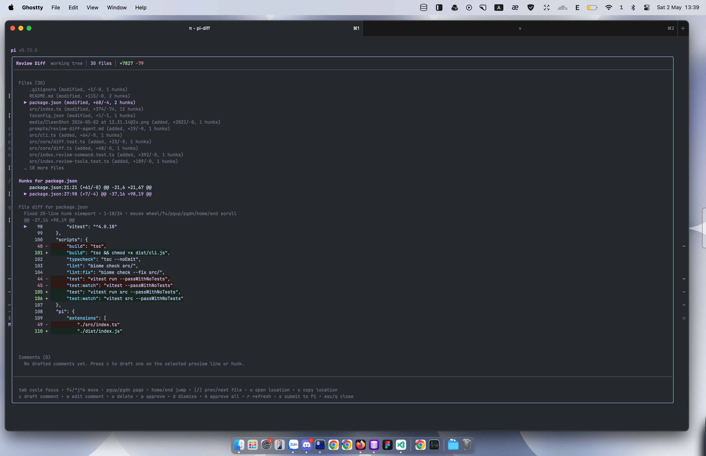

# pi-diff

[](https://www.npmjs.com/package/@heyhuynhgiabuu/pi-diff)
[](https://github.com/buddingnewinsights/pi-diff/releases/latest)

A [pi](https://pi.dev) extension that replaces the default `write` and `edit` tool output with **Shiki-powered, syntax-highlighted diffs** — side-by-side split view, unified stacked view, and word-level change emphasis, all rendered directly in your terminal.

> **Status:** Early release.

### Unified view — stacked single-column diff


### Split view — side-by-side comparison


## Features

- **Syntax-highlighted diffs** — full Shiki grammar highlighting (190+ languages) composited with diff background colors
- **Split view** — side-by-side comparison for `edit` tool, auto-falls back to unified on narrow terminals
- **Unified view** — stacked single-column layout for `write` tool overwrites
- **Word-level emphasis** — changed characters get brighter backgrounds so you see exactly what changed
- **New file preview** — syntax-highlighted preview when creating files
- **Adaptive layout** — auto-detects terminal width; wraps intelligently on wide terminals, truncates on narrow ones
- **LRU cache** — singleton Shiki highlighter with 192-entry cache for fast re-renders
- **Large diff fallback** — gracefully degrades (skips highlighting, still shows diff structure) for files > 80k chars
- **Review context export** — `pi-diff-review` exports Git changes as agent-ready markdown for Warp-style local code review
- **Fully customizable** — every color and threshold is overridable via environment variables

## Install

```bash
pi install npm:@heyhuynhgiabuu/pi-diff
```

Latest release: https://github.com/buddingnewinsights/pi-diff/releases/latest

Or load directly for development:

```bash
pi -e ./src/index.ts
```

## Git Review in Pi TUI

pi-diff now has two review paths:

1. **`/review-diff`** — the primary interactive local-review command
2. **`review_git_diff`** — the read-only markdown/tooling path for agent context and scripted review

### `/review-diff` — interactive local review

Use `/review-diff` inside Pi TUI to open a full-width centered review overlay for your local Git diff.



```text
/review-diff
/review-diff --base main
/review-diff working-tree
/review-diff feature/base-branch
```

What the overlay supports now:
- keyboard-driven file navigation
- hunk navigation for the selected file
- a fixed-height focused **hunk diff viewport** instead of a panel that grows/shrinks with diff size
- hunk-level preview scrolling inside the selected hunk, with scroll status and a visible `▶` selection marker
- load the selected file/line into Pi's main editor as review context
- copy the selected file/line/hunk reference to the clipboard
- line-anchored draft/edit/delete review comments
- approve/dismiss comments before submission
- batch-submit approved comments back into Pi as a follow-up prompt
- live auto-refresh while the overlay is open when the local git diff changes
- manual refresh of the current diff without leaving the review flow
- session persistence via Pi custom entries so reopening `/review-diff` restores the latest review state for the current session

Key bindings in the overlay:
- `Tab` cycles focus between files, hunks, preview, and comments
- `↑↓` / `Ctrl+j` / `Ctrl+k` navigate the focused region; in Preview focus this scrolls the selected hunk while keeping rendered content visible
- `PageUp` / `PageDown` move by a full visible page in the focused region; in Preview focus this scrolls the selected hunk viewport
- `Home` / `End` jump to the start/end of the focused region; in Preview focus this jumps within the selected hunk viewport
- mouse wheel scrolls the selected hunk viewport vertically when Pi forwards terminal wheel events to the overlay
- `[` / `]` jump between files
- `o` loads the selected file/line into Pi's main editor as review context
- `y` copies the selected file/line/hunk reference to the clipboard; if clipboard access fails, it loads the reference into Pi's main editor
- `c` drafts a comment on the current hunk / anchored preview line
- `e` edits the selected comment; if none exists yet, the overlay warns instead of silently doing nothing
- `x` deletes the selected comment
- `a` approves the selected comment
- `d` dismisses the selected comment
- `A` approves all comments
- `r` manually refreshes the diff immediately (the overlay also auto-refreshes while open)
- `s` submits approved comments back to Pi
- `Esc` / `q` closes the overlay

**Important:** `/review-diff` is a command, not a prompt template. Pi resolves extension commands before prompt templates, so a prompt template with the same name would be shadowed and never run.

### `/review-diff-agent` — prompt template companion

If you want a blunt text review from the agent instead of the interactive overlay, use the bundled prompt template:

```text
/review-diff-agent
```

This prompt asks the agent to use `review_git_diff` as needed and produce a brutal review of the current local diff.

### `review_git_diff` — read-only markdown review tool

`review_git_diff` remains available for agent/tool use and for non-destructive markdown exports.

```ts
// Open the read-only review markdown for working-tree changes, including untracked files
review_git_diff({})

// Review branch changes as main...HEAD
review_git_diff({ base: "main" })

// Focus a file from the changed-file list
review_git_diff({ file: "src/index.ts" })

// Focus a hunk ID shown by the panel
review_git_diff({ file: "src/index.ts", hunkId: "src/index.ts:10:12" })

// Draft inline comments through the tool API
review_git_comment({ file: "src/index.ts", line: 42, body: "This needs a regression test." })

// List or clear drafted comments
review_git_comments({})
review_git_comments({ clear: true })

// Return the older full markdown export with raw unified diff included
review_git_diff({ base: "main", includeRawDiff: true })
```

- No `base` means working-tree review, including untracked files.
- `base: "main"` means `main...HEAD` branch review.
- `includeRawDiff` returns the older full review export with raw unified diff.
- `maxLinesPerHunk`, `maxFiles`, and `maxHunks` cap large markdown reviews.
- The tool path is intentionally non-destructive: it never reverts, stages, commits, discards, or edits files.

## Review Export CLI

`pi-diff-review` exports the same Git review context as markdown for use outside Pi TUI.

```bash
# Review uncommitted working-tree changes
pi-diff-review

# Review branch changes like a pull request
pi-diff-review --base main

# Include the raw git diff after the structured summary
pi-diff-review --raw
```

The export includes changed files, hunk headers, changed-line numbers, and review instructions focused on correctness, regressions, security, tests, and maintainability.

## How It Works

pi-diff wraps the built-in `write` and `edit` tools from the pi SDK, including single-edit and multi-edit `edit` calls. When the agent writes or edits a file:

1. **Before the write** — reads the existing file content
2. **Delegates** to the original SDK tool (file is actually written)
3. **After the write** — computes a structured diff between old and new content
4. **Renders** the diff with syntax highlighting and word-level emphasis

The rendering pipeline:

```
Old content ──┐
              ├── diff (structuredPatch) ── parse ── highlight (Shiki → ANSI)
New content ──┘                                          │
                                                         ├── inject diff bg
                                                         ├── inject word-level bg
                                                         └── wrap/fit to terminal
```

### Views

| View | Used by | Description |
|------|---------|-------------|
| **Split** | `edit` tool | Side-by-side with old on left, new on right. Diagonal stripes fill empty slots. Auto-falls back to unified when terminal < 150 cols or > 20% of lines would wrap. |
| **Unified** | `write` tool | Single column with `+`/`-` gutter. Compact, works at any terminal width. |

Both views show:
- Colored border bars (`▌`) for changed lines
- Line numbers in the gutter
- Hunk separators (`··· N unmodified lines ···`)
- Word-level emphasis on paired add/del lines

## Configuration

### Diff Theme Presets

pi-diff ships with built-in theme presets optimized for different terminal backgrounds. Add to your `.pi/settings.json`:

```json
{
  "theme": "dark",
  "diffTheme": "midnight"
}
```

| Preset | Best for | Description |
|--------|----------|-------------|
| `default` | Dark theme bases (~`#1e1e2e`) | Original pi-diff colors — balanced contrast |
| `midnight` | Pure black (`#000000`) terminals | Subtle tints that don't overwhelm on black |
| `subtle` | Any dark theme | Minimal backgrounds — barely-there tints for a clean look |
| `neon` | Low-contrast displays | Higher contrast backgrounds for better visibility |

### Per-Color Overrides

Override individual diff colors in `.pi/settings.json` using hex `#RRGGBB` values:

```json
{
  "theme": "dark",
  "diffTheme": "midnight",
  "diffColors": {
    "bgAdd": "#0d1a12",
    "bgDel": "#1a0d0d",
    "bgAddHighlight": "#1a3825",
    "bgDelHighlight": "#381a1a",
    "bgGutterAdd": "#091208",
    "bgGutterDel": "#120908",
    "bgEmpty": "#080808",
    "fgAdd": "#64b478",
    "fgDel": "#c86464",
    "fgDim": "#404040",
    "fgLnum": "#505050",
    "fgRule": "#282828",
    "fgStripe": "#1e1e1e",
    "fgSafeMuted": "#8b949e",
    "shikiTheme": "github-dark"
  }
}
```

`diffColors` overrides take priority over `diffTheme` presets, so you can start from a preset and tweak individual colors.

### Auto-Derive (Default Behavior)

When no `diffTheme` or `diffColors` is set, pi-diff **automatically derives** background colors from your pi theme's diff foreground colors and tool-state backgrounds. Added/context surfaces use `toolSuccessBg`; removed surfaces use `toolErrorBg`. This ensures diffs look good with any pi theme and terminal background — no configuration needed.

The auto-derive uses different intensity levels:
- **Line backgrounds**: 8–10% of the theme's diff fg color mixed into the matching tool-state background (subtle tint)
- **Word highlights**: 20–22% (more visible for changed characters)
- **Gutters**: 5–6% (subtler than line backgrounds)

### Color Resolution Order

For each color, pi-diff checks (highest priority first):

1. **Environment variable** — e.g. `DIFF_BG_ADD="#1a3320"` (backward compatible)
2. **`diffColors`** from `.pi/settings.json` (per-color hex overrides)
3. **`diffTheme` preset** from `.pi/settings.json` (named preset bundle)
4. **Auto-derived** from pi theme's `toolDiffAdded`/`toolDiffRemoved` colors
5. **Hardcoded fallback** (original defaults)

### Environment Variables

All settings are also controllable via environment variables. Add them to your shell profile or `.envrc`:

### Theme

| Variable | Default | Description |
|----------|---------|-------------|
| `DIFF_THEME` | `github-dark` | Shiki theme name (e.g., `dracula`, `one-dark-pro`, `catppuccin-mocha`) |

### Colors

Override any diff color with hex `#RRGGBB` format:

| Variable | Default | Description |
|----------|---------|-------------|
| `DIFF_BG_ADD` | `#162620` | Background for added lines |
| `DIFF_BG_DEL` | `#2d1919` | Background for removed lines |
| `DIFF_BG_ADD_HL` | `#234b32` | Word-level emphasis on added text |
| `DIFF_BG_DEL_HL` | `#502323` | Word-level emphasis on removed text |
| `DIFF_BG_GUTTER_ADD` | `#12201a` | Gutter background for added lines |
| `DIFF_BG_GUTTER_DEL` | `#261616` | Gutter background for removed lines |
| `DIFF_FG_ADD` | `#64b478` | Foreground for `+` signs and add indicators |
| `DIFF_FG_DEL` | `#c86464` | Foreground for `-` signs and del indicators |

### Layout

| Variable | Default | Description |
|----------|---------|-------------|
| `DIFF_SPLIT_MIN_WIDTH` | `150` | Minimum terminal columns to use split view |
| `DIFF_SPLIT_MIN_CODE_WIDTH` | `60` | Minimum code columns per side in split view |

### Example `.envrc`

```bash
# Use a different Shiki theme
export DIFF_THEME="catppuccin-mocha"

# Brighter add backgrounds
export DIFF_BG_ADD="#1a3a25"
export DIFF_BG_ADD_HL="#2d6040"

# Allow split view on narrower terminals
export DIFF_SPLIT_MIN_WIDTH=120
```

## Architecture

```
src/
└── index.ts    # Extension entry point — wraps write/edit tools with diff rendering
```

### Key internals

| Component | Purpose |
|-----------|---------|
| `parseDiff()` | Converts old/new content to structured `DiffLine[]` using `diff.structuredPatch` |
| `hlBlock()` | Shiki ANSI highlighting with LRU cache (192 entries) |
| `injectBg()` | Composites diff backgrounds into Shiki ANSI output (fg + bg layering) |
| `wordDiffAnalysis()` | Single-pass word diff → similarity score + character ranges |
| `renderSplit()` | Side-by-side renderer with diagonal stripe fillers |
| `renderUnified()` | Stacked single-column renderer |
| `wrapAnsi()` | ANSI-aware line wrapping with state carry-forward |
| `shouldUseSplit()` | Heuristic: split vs unified based on terminal width and wrap ratio |

### Rendering constants

| Constant | Value | Description |
|----------|-------|-------------|
| `MAX_PREVIEW_LINES` | 60 | Max lines in edit preview (split view) |
| `MAX_RENDER_LINES` | 150 | Max lines in write result (unified view) |
| `MAX_HL_CHARS` | 80,000 | Skip syntax highlighting above this |
| `CACHE_LIMIT` | 192 | LRU cache entries for highlighted blocks |
| `WORD_DIFF_MIN_SIM` | 0.15 | Minimum similarity for word-level emphasis |

## Exports

The extension exports a `__testing` object for unit testing:

```typescript
import { __testing } from "@heyhuynhgiabuu/pi-diff";

const { parseDiff, renderSplit, renderUnified, normalizeShikiContrast } = __testing;
```

## Development

```bash
git clone https://github.com/buddingnewinsights/pi-diff.git
cd pi-diff
npm install
npm run typecheck   # TypeScript validation
npm run lint        # Biome linting
npm test            # Run tests
```

### Load in pi for testing

```bash
# From the pi-diff directory
pi -e ./src/index.ts

# Or install globally
pi install .
```

## How pi Extensions Work

pi-diff is a **pi extension** — a TypeScript file that exports a default function receiving the pi API:

```typescript
export default function piDiffExtension(pi: any): void {
  // Get SDK tools
  const origWrite = createWriteTool(cwd);
  const origEdit = createEditTool(cwd);

  // Register enhanced versions
  pi.registerTool({
    ...origWrite,
    name: "write",
    execute: async (...) => { /* wrap + diff */ },
    renderCall: (...) => { /* preview */ },
    renderResult: (...) => { /* render diff */ },
  });
}
```

Extensions can:
- **Register tools** — `pi.registerTool(definition)` 
- **Listen to events** — `pi.on("session_start" | "input" | "before_tool_call" | ...)`
- **Register commands** — `pi.registerCommand("/name", handler)`
- **Register providers** — `pi.registerProvider("name", config)`

See the [pi docs](https://pi.dev) for the full extension API.

## License

MIT — [huynhgiabuu](https://github.com/buddingnewinsights)
